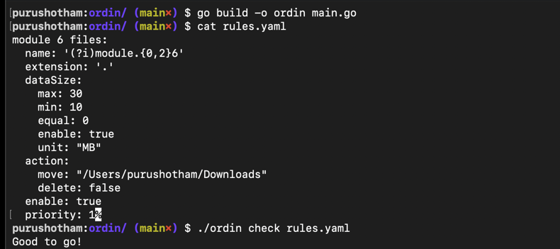
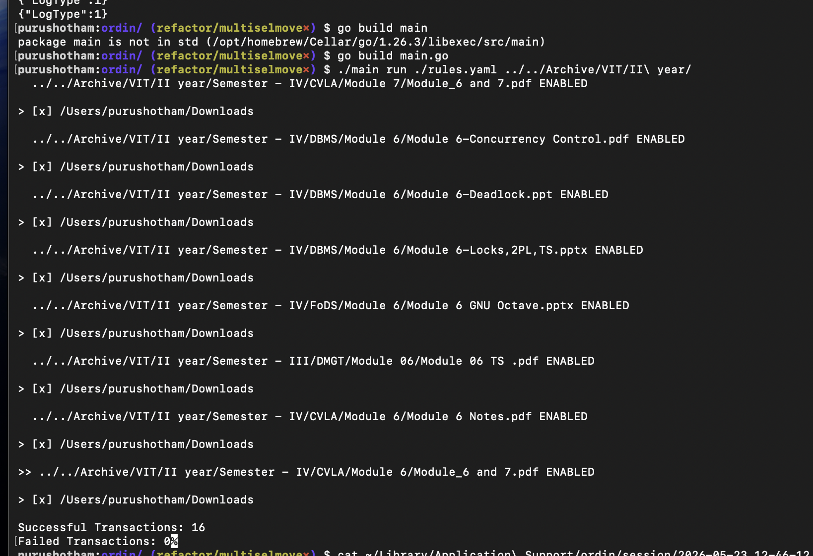
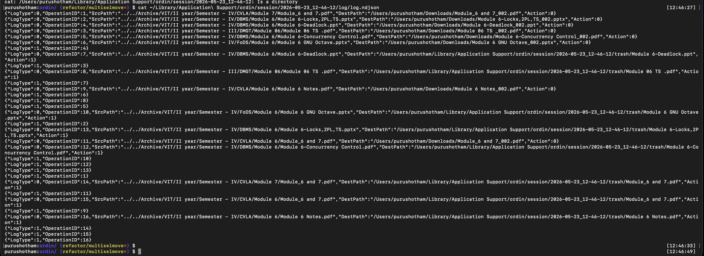
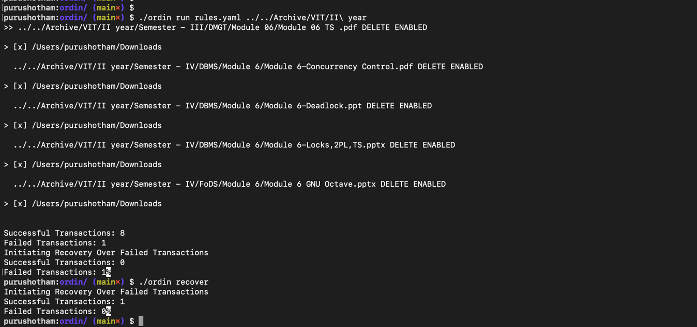

# Ordin

A rule-based file organizer with a TUI, built in Go. Define rules in a YAML file, run a dry run to preview, then execute. Moves, copies, and trashes files based on regex patterns with a WAL-backed operation log.

## Check Demo:


## Run Demo:


Both dryrun and run has the same interface as above, dryrun just lets you see what changes will occur and run will execute it.

## Log Demo:


## Recovery Demo:


>NOTE: In the run command, the post run recovery failed due to me renaming the source path of the file mid TUI in another tab, in recover command i have undone my rename and hence it managed to recover.This was done purely for demo pruposes
---

## Features

- Rule-based file matching via regex (name + extension)
- Dry run mode — preview what will happen before committing
- Concurrent executor with worker pool — fails fast on fatal errors
- WAL logging to `UserConfigDir/ordin/session/<timestamp>/log/log.ndjson`
- Soft deletes — moved files go to a session trash folder before being removed

---

## Installation

```sh
git clone https://github.com/mundano17/ordin
cd ordin
go build main.go
```

---

## Usage

```sh
# Preview what will be executed
./main dryrun <rules.yaml> <working_dir>

# Execute
./main run <rules.yaml> <working_dir>
```

### Run Instructions:

- Arrow keys for moving around filenames (srcpaths)
- Space to select a filename and you can now choose all the destination paths.
- Space again to select and Esc to go back and move around filenames
- Ctrl + S to save and run (no-op in dryrun mode).

---

## Rules

Rules are defined in a YAML file. Each rule has a name regex, extension regex, an action, and optional size filters.

```yaml
group a:
  name: '(?i)module.{0,2}6'   # regex matched against filename
  extension: '.'               # regex matched against extension (. = any)
  dataSize:
    enable: false              # set true to filter by file size
    min: 0
    max: 0
    equal: 0
    unit: "MB"                 # can be KB,MB or GB
  action:
    move: "/Users/you/Downloads"   # move to this path (soft delete from source)
    copy: ""                       # copy to this path (keeps original)
    delete: false                  # delete without copying
  enable: true
  priority: 1                  # lower runs first
```

Multiple rules can be defined in the same file. Rules are sorted by priority before execution.

---

## How it works

1. **Parser** — reads and validates `rules.yaml`
2. **Planner** — walks the working directory, matches files against rules, builds a plan
3. **Dry run** — shows the plan in a TUI before you commit
4. **Executor** — runs the plan concurrently with a worker pool. On fatal error, cancels remaining workers and exits
5. **WAL** — every operation is logged before and after execution. Session logs and trash live in `UserConfigDir/ordin/session/<timestamp>/`

---

## Known Issues

- Symlinks not supported

## Roadmap

- [ ] Bug fixes and broader testing

---

## Built with

Go, [bubbletea](https://github.com/charmbracelet/bubbletea), [urfave/cli](https://github.com/urfave/cli), [errgroup](https://pkg.go.dev/golang.org/x/sync/errgroup)